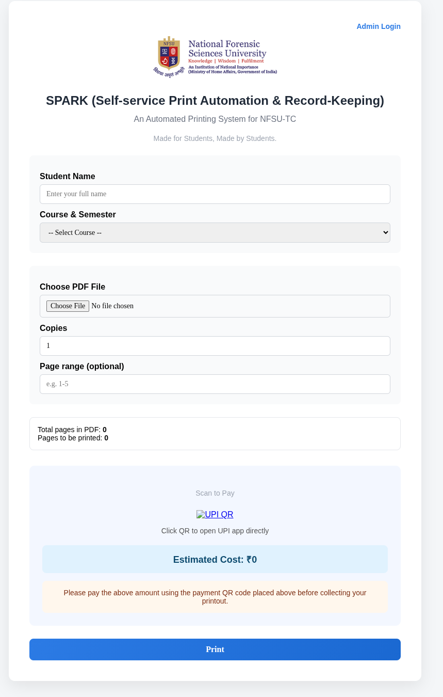
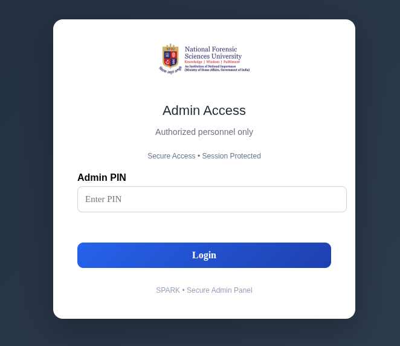
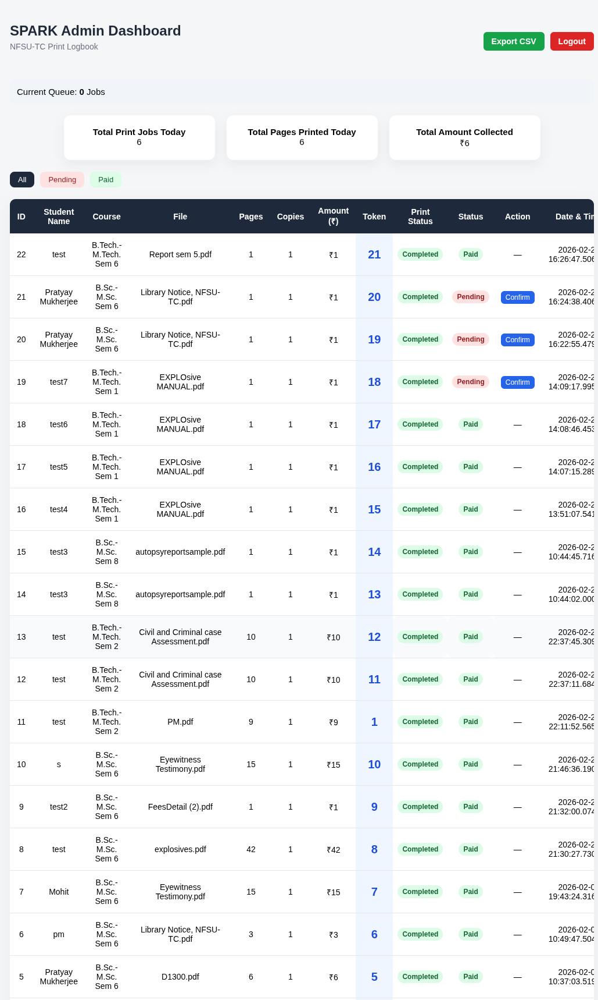

# SPARK – Self-Service Print Automation & Record-Keeping

SPARK is a campus printing automation system designed to digitize and streamline printing workflows using Flask, SQLite, and CUPS.

## Features

- PDF upload with automatic page detection (PDF.js)
- Token-based queue system (First-Come, First-Serve)
- UPI payment integration
- Secure admin login (hashed password)
- Real-time job tracking
- CSV export for auditing
- Canon imageRUNNER 2925 integration via CUPS

## Project Screenshots

*1. SPARK Main Dashboard*



*2. SPARK Admin Login*



*3. SPARK Admin Dashboard (Logbook)*



## Tech Stack

Frontend: HTML, CSS, JavaScript  
Backend: Flask (Python)  
Database: SQLite  
Printing: CUPS (Linux)

## Setup Instructions

1. Clone the repository:
   ```bash
   git clone https://github.com/distortedteen/spark-print-automation.git
   ```
   
3. Navigate into the project directory:
   ```bash
   cd spark-print-automation
   ```
   
5. Install dependencies:
   ```bash
   pip install -r requirements.txt
   ```
7. Run the application in terminal:
   ```bash
   python3 app.py
   ```
9. Access the application locally at:
   http://127.0.0.1:5000

## Deployment

Designed for deployment within campus infrastructure using existing printers.
